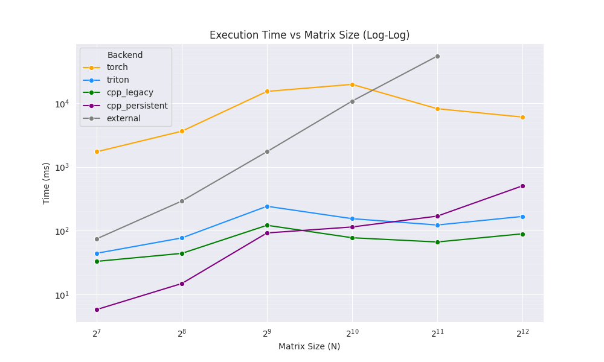
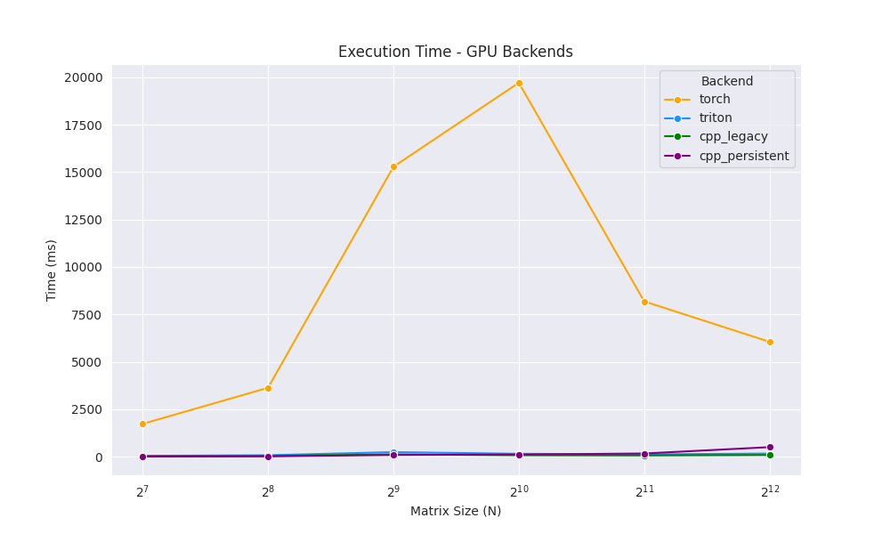
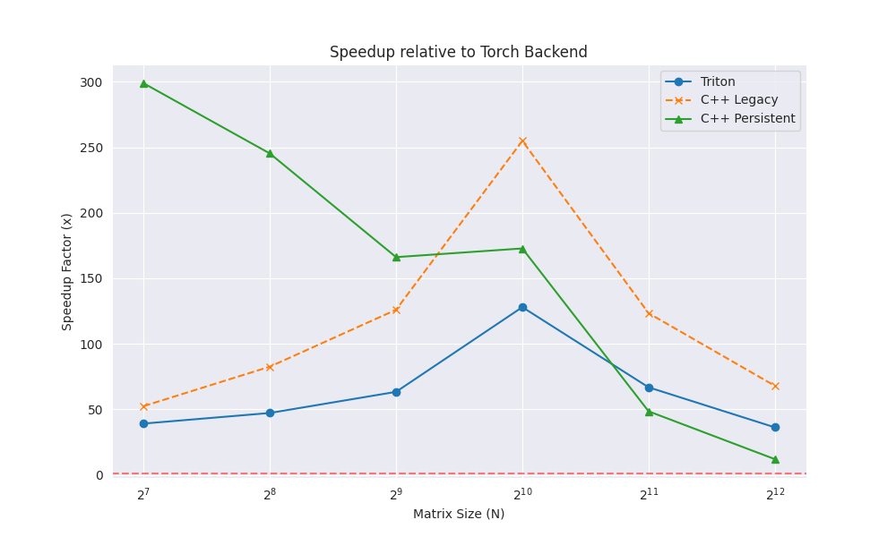

# Efficient Linear Assignment

A high-performance, differentiable solver for the **Linear Assignment Problem (LAP)**, built on PyTorch.

This library implements the **Auction Algorithm** with GPU acceleration via **Triton** and **CUDA/C++** backends. It is designed for deep learning pipelines where assignments need to be computed dynamically during training (e.g., set prediction, tracking, matching).

## Features

- **🚀 High Performance**: Faster than `scipy.optimize.linear_sum_assignment` and purely solving on GPU.
- **🔥 Differentiable**: Supports backward passes via Implicit Maximum Likelihood Estimation (IMLE).
- **⚡ Mixed Precision**: Optimizes memory bandwidth by accepting `Float16` inputs while maintaining `Float32` precision for internal stability.
- **🛡️ Robust**: Handles degenerate cases (all-zero costs, flat surfaces) with strict collision resolution guarantees.
- **🔌 Pluggable Backends**: Switch between `torch` (reference), `triton` (fused), and `cpp` (CUDA optimized) implementations.

## Installation

```bash
pip install .
```

_Requirements_:

- PyTorch >= 2.0
- Triton (for `backend='triton'`)
- CUDA Toolkit (for `backend='cpp'`)

## Usage

### Basic Example

```python
import torch
from efficient_linear_assignment import linear_assignment

# 1. Create a Cost Matrix (Batch, N, M)
# Constraints: N and M must be multiples of 8.
B, N, M = 4, 128, 128
cost_matrix = torch.rand((B, N, M), device='cuda', dtype=torch.float16)

# 2. Solve (Returns Indices)
# indices: (B, N) tensor where indices[b, i] = j means agent i assigned to object j
indices = linear_assignment(
    cost_matrix,
    backend='cpp',  # Options: 'torch', 'triton', 'cpp'
    epsilon=1e-2,
    max_iter=1000
)

# 3. Solve (Returns One-Hot Matrix for Gradients)
assignment_matrix = linear_assignment(
    cost_matrix,
    backend='triton',
    return_indices=False
)
# assignment_matrix is differentiable!
loss = (assignment_matrix * cost_matrix).sum()
loss.backward()
```

### Input Constraints & Padded Inputs

To maximize kernel efficiency, input dimensions **$N$ and $M$ must be multiples of 8**.
If your data size is arbitrary, please pad your input tensors before calling the solver:

```python
from efficient_linear_assignment.utils import pad_input, check_dims

cost_matrix = ... # shape (1, 10, 10)
# Pad to (1, 16, 16)
padded_cost, original_shape = pad_input(cost_matrix, multiple=8)

# Solve
indices = linear_assignment(padded_cost)

# Crop back to valid range logic...
```

## Architecture

This library uses a "Ping-Pong" architecture where:

1.  **GPU Kernel**: Computes bids (Top-2 benefits) for all agents in parallel.
2.  **Python Native**: Performs price updates and collision resolution on the GPU tensors.

For a deep dive into the design and future optimization plans (Persistent Kernels, Atomics), please see:

- [Architecture Overview](architecture.md)
- [Optimization Roadmap](architecture_optimization_plan.md)

## Performance

Results from benchmarking on NVIDIA GeForce RTX 5070 Ti (B=1).

**Comparison vs. Baseline (`torch`) and External (`torch-linear-assignment` Hungarian implementation).**

| Size (N) | CPU Hungarian (ms) | Torch (ms) | Triton (ms) | **Proprietary C++ (ms)** | Abs. Speedup vs Torch |
| :------- | :----------------- | :--------- | :---------- | :----------------------- | :-------------------- |
| **128**  | 7.94               | 1,728      | 44.1        | **5.8**                  | **~298x**             |
| **256**  | 59.55              | 3,630      | 76.8        | **14.8**                 | **~245x**             |
| **512**  | 283.20             | 15,279     | 241.0       | **91.9**                 | **~166x**             |
| **1024** | 1,788.80           | 19,706     | 153.9       | **77.3**                 | **~254x**             |
| **4096** | N/A                | 6,052\*    | 166.8       | **89.0**                 | **~67x**              |

_(Torch timings N<1024 are notably slow due to Python overhead in the iterative loop)_

### Benchmark Visuals

**1. Execution Time (Log Scale)**


**2. GPU Backends Comparison (Linear Scale)**


**3. Speedup Factor vs Torch**


## Backends

| Backend      | Description                | Pros                                          | Cons                                 |
| :----------- | :------------------------- | :-------------------------------------------- | :----------------------------------- |
| **`torch`**  | Pure PyTorch operations    | No extra deps, stable reference.              | Slower, high overhead.               |
| **`triton`** | OpenAI Triton Kernels      | Fast, readable.                               | **~5x Slower than C++** for small N. |
| **`cpp`**    | **Proprietary C++ / CUDA** | **Fastest (<6ms)**. Async Persistent Kernels. | Requires build step.                 |

## License

[License Name]
